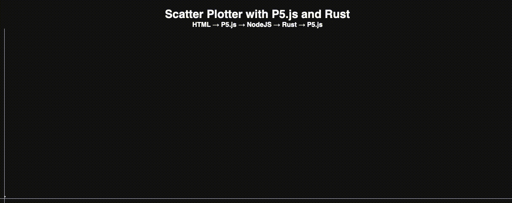

# scatter-plotter

 
To get to know RUST with [this guide by Second State!](https://www.secondstate.io/articles/getting-started-with-rust-function/) I visualised sequence of numbers [A002487 - Stern's diatomic series](https://oeis.org/A002487) which creates curious patterns reminiscent of a row of towers.
##### Dependancies
- Docker
- NPM
- SSVM
- NodeJS

##### To run the project
```src
# Get the code
$ git clone https://github.com/nedkamburov/scatter-plotter.git
$ cd scatter-plotter

# Run Docker container
$ docker pull secondstate/ssvm-nodejs-starter:v1
$ docker run -p 3000:3000 --rm -it -v $(pwd):/app secondstate/ssvm-nodejs-starter:v1
(docker) $ cd /app

# Build Rust functions
(docker) $ ssvmup build

# Build NodeJS dependancies
(docker) $ npm install

# Run the server
(docker) $ node node/server.js
```
##### Preview



